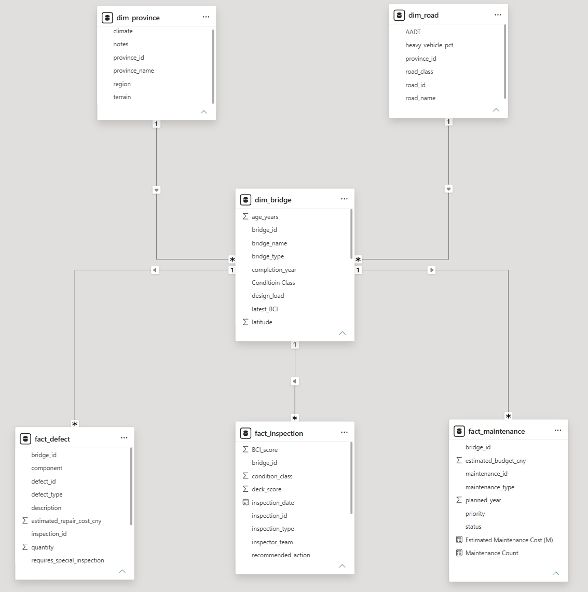
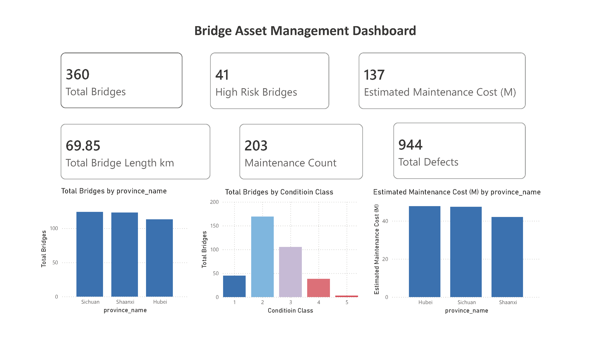
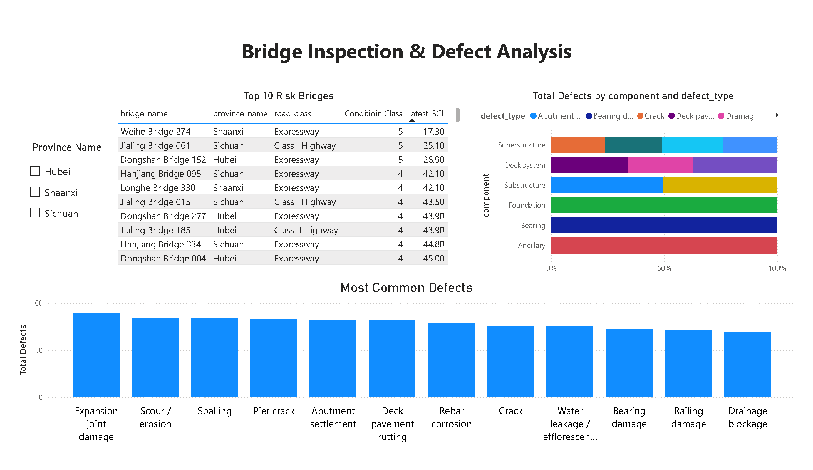

# Bridge Asset Analytics

## Project Overview

This project demonstrates an end-to-end bridge asset analytics solution using **MySQL** and **Power BI**.

The project simulates how a transport agency can analyse bridge assets, inspection records, defect information and maintenance plans to support infrastructure planning, maintenance prioritisation and reporting.

The workflow covers the complete analytics process from relational database design and SQL querying to interactive dashboard development and business reporting.

---

## Business Scenario

A transport authority is responsible for managing bridge assets across multiple provinces.

Bridge inspection data, defect records and maintenance plans are collected from different operational systems. Decision makers require reliable reporting to identify high-risk bridges, understand asset condition trends and support maintenance budgeting.

This project demonstrates how these datasets can be integrated into a relational database and transformed into meaningful business insights.

---

## Project Objectives

- Design a relational database using a dimensional (Star Schema) model
- Analyse bridge inspection, defect and maintenance data using SQL
- Develop an interactive Power BI dashboard for infrastructure reporting
- Identify high-risk bridges requiring maintenance attention
- Support data-driven maintenance planning and budget allocation

---

## Data Model



The database follows a dimensional modelling approach.

### Dimension Tables

- **dim_bridge** – Bridge asset information
- **dim_province** – Province information
- **dim_road** – Road network information

### Fact Tables

- **fact_inspection** – Bridge inspection records
- **fact_defect** – Recorded bridge defects
- **fact_maintenance** – Planned maintenance activities

The bridge table acts as the central dimension connecting inspection, defect and maintenance information.

---

## Database & SQL

The project database was built in MySQL.

Example SQL analysis includes:

- Total bridge assets
- Bridge distribution by province
- Bridge condition analysis
- Defect statistics
- Maintenance cost summary
- SQL JOIN between dimension and fact tables
- CASE WHEN for business classification

---

## Power BI Dashboard

The dashboard provides an overview of bridge asset performance through interactive visualisations.

### Dashboard 1 – Executive Summary



Includes:

- Total Bridges
- High Risk Bridges
- Total Maintenance Cost
- Total Defects
- Total Bridge Length
- Maintenance Count
- Bridge distribution by province
- Bridge condition distribution by province
- Bridge maintenance cost distribution by province

### Dashboard 2 – Inspection & Defect Analysis



Includes:

- Province slicer
- Top 10 high-risk bridges
- Defect distribution by bridge component
- Most common defect types

---

## Key Business Insights

Example insights generated from the dashboard include:

- Provinces with the highest maintenance investment
- Distribution of bridge condition ratings
- Most common bridge defect types
- Bridges requiring priority maintenance
- Relationships between inspection results and maintenance planning

---

## Repository Structure

```
bridge-asset-analytics
│
├── data
│   ├── dim_bridge.csv
│   ├── dim_province.csv
│   ├── dim_road.csv
│   ├── fact_defect.csv
│   ├── fact_inspection.csv
│   ├── fact_maintenance.csv
│   └── data_dictionary.csv
│
├── images
│   ├── dashboard_page1.png
│   ├── dashboard_page2.png
│   └── data_model.png
│
├── powerbi
│   └── Bridge Asset Dashboard.pbix
│
├── python
│   └── generate_bridge_data.py
│
├── sql
│   ├── 01_database_setup.sql
│   ├── 02_basic_queries.sql
│   ├── 03_join_queries.sql
│   └── 04_case_when.sql
│
└── README.md
```

---

## Tools Used

- MySQL
- MySQL Workbench
- Power BI
- Python
- GitHub

---

## Future Improvements

Future enhancements may include:

- Common Table Expressions (CTEs)
- Window Functions
- Advanced SQL optimisation
- Time-series bridge condition analysis
- Predictive maintenance modelling
- Integration with GIS data

---

## Author

**Ming Ding**

Master of Artificial Intelligence and Machine Learning  
The University of Adelaide

Interested in Data Analytics, Business Intelligence and Infrastructure Asset Management.
